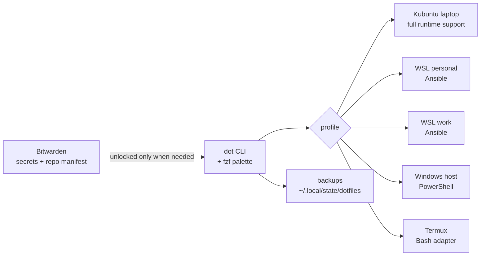

<div align="center">

# dotfiles

### One command. Five environments. A workstation that rebuilds itself.

**Kubuntu · WSL · Windows · Termux**

[](https://github.com/DovieW/dotfiles/actions/workflows/validate.yml)
[](LICENSE)
[](config/shell/zshrc)
[](ansible/local.yml)

My reproducible development environment, desktop, tools, and operating-system
preferences—kept portable, inspectable, and pleasant to maintain.

</div>

---

## What this is

This repository turns a fresh machine into *my* machine without requiring a
full declarative operating system. It manages the everyday details that are
otherwise easy to forget: packages, shells, Git, editors, terminals, desktop
behavior, credentials, services, updates, and recovery.

The interface is `dot`, a single cross-platform command with an fzf command
palette:

```console
$ dot

  Apply configuration       Reconcile this machine with its profile
  Update everything         Upgrade every managed stable provider
  Save local changes        Review, validate, commit, and push
  Run diagnostics           Explain package, service, and config drift
  Manage repositories       Clone and synchronize private working copies
  More…                     Every supported operation is reachable here
```

You can live in the menu and never memorize a command. Every action remains
available as a scriptable CLI for automation.

## The shape of the system



| Area | What is managed |
| --- | --- |
| **Desktop** | Plasma panel, shortcuts, window rules, gestures, cursor, fonts, factory OLED calibration, power behavior, lock screen, screenshots, clipboard history, emoji |
| **Terminal** | Ghostty, one persistent tmux session, Zsh, full Bash, visibly minimal `mbash`, Powerlevel10k |
| **Development** | Git, Delta, fzf, Neovim, VS Code, Docker Engine, Lazygit, Lazydocker, language tooling |
| **Connectivity** | Tailscale and fullscreen company RDP files on native Kubuntu; Windows-host networking for WSL |
| **Applications** | Stable-provider installs for Bitwarden, Obsidian, ChatGPT Desktop with Codex, the Codex CLI, Vite+, and the declared package catalog |
| **Identity** | Per-device Ed25519 authentication and commit signing through Bitwarden and GitHub |
| **Safety** | Drift detection, selective KDE capture, automatic backups, rollback, secret scanning, and idempotence tests |

## Quick start

### Kubuntu or WSL

```bash
git clone https://github.com/DovieW/dotfiles ~/repos/dotfiles
~/repos/dotfiles/bin/dot bootstrap --profile kubuntu-laptop
```

Replace `kubuntu-laptop` with `wsl-personal` or `wsl-work` where appropriate.
Bootstrap checks prerequisites, establishes the device identity, prepares
credentials, and applies the selected profile. It links the canonical CLI to
`~/.local/bin/dot`, so every later command is simply:

```bash
dot
```

### Windows

Use the matching PowerShell entry point:

```powershell
git clone https://github.com/DovieW/dotfiles "$HOME\repos\dotfiles"
& "$HOME\repos\dotfiles\bin\dot.ps1" bootstrap --profile windows-host
```

Windows is deliberately inventory-first. Bootstrap checks Git, Bitwarden CLI,
GitHub CLI, and PowerShell, then prints exact remediation commands instead of
silently installing applications.

### Termux

```bash
git clone https://github.com/DovieW/dotfiles ~/repos/dotfiles
~/repos/dotfiles/bootstrap-termux.sh
```

## Everyday use

The no-argument palette is the primary interface:

```bash
dot
```

The most useful direct commands are:

```bash
dot update                         # upgrade everything managed on this machine
dot doctor --profile kubuntu-laptop
dot save                           # fzf review → test → signed commit → push
dot apply --profile kubuntu-laptop
dot panel                          # choose a native Plasma taskbar profile
dot clipboard                     # verify CopyQ history and Emoji Picker
dot repos sync --profile kubuntu-laptop
```

### Transcription

The Linux shell profile installs
[`transcribe`](https://github.com/DovieW/transcribe-cli), the standalone public
TypeScript/OpenTUI application for Linux and WSL. Dotfiles downloads a pinned,
checksum-verified GitHub release; running it needs neither Node nor Bun. Use the
action launcher without arguments or its clean scriptable interface:

```bash
transcribe
transcribe run recording.mp4 --name interview --provider openai --model gpt-4o-transcribe
transcribe run 'https://www.youtube.com/watch?v=…' --provider youtube-transcript
transcribe resume RUN_ID
transcribe restart RUN_ID
transcribe compare RUN_A RUN_B
transcribe export RUN_ID --format json --output ./transcript.json
transcribe doctor
```

The library supports local media, individual YouTube videos, playlists,
existing YouTube subtitles and cleanup, Groq/OpenAI/Fireworks, bounded retries,
chunk concurrency, safe pause/resume, named alternative runs, TXT/JSON export,
and a searchable transcript workbench. The top-level Quick Transcribe action
uses the remembered settings, starts immediately after local-file selection,
and opens the completed transcript. Viewer search, match navigation, terminal
clipboard copy, timestamp/speaker formatting, and `$EDITOR` handoff are built
in. Normalized audio and work files remain in the central XDG library rather
than cluttering source directories.

SQLite indexes the library under `~/.local/state/transcribe`; portable
`source.json` and `run.json` manifests remain beside artifacts. Settings are
stored with mode `0600` under `~/.config/transcribe`. Existing dotfiles users
continue using their earlier library automatically, and managed Bash-era runs
are imported idempotently on first launch. Run `transcribe migrate PATH` for an
explicitly selected older work directory.

The model picker follows the selected provider. OpenAI offers `whisper-1`,
`gpt-4o-mini-transcribe`, and `gpt-4o-transcribe` for ordinary transcription;
enabling diarization selects `gpt-4o-transcribe-diarize`. Groq offers
`whisper-large-v3` and `whisper-large-v3-turbo`. Fireworks retains its
`whisper-v3` and `whisper-v3-turbo` choices.

The comparison UI first chooses one source and exactly two completed named runs;
it can also accept external TXT files. OpenAI `gpt-5.6-luna` returns an
ephemeral judgment that is never added to the library.

Credentials come only from `GROQ_API_KEY`, `OPENAI_API_KEY`, or
`FIREWORKS_API_KEY` in the current process environment. The program never
prompts for, stores, or retrieves keys from Bitwarden.

### Clipboard and emoji that behave naturally

CopyQ replaces Klipper for searchable clipboard history; it is deliberately
kept to one job and one hidden tray-free tab. `Meta+V` opens the history and
pastes the selected item directly. Image MIME data stays available on the live
system clipboard but is not archived by CopyQ, avoiding an upstream Wayland
clipboard-monitor crash triggered by transient screenshot providers.

`Meta+.` opens [jockel09/emoji-picker](https://github.com/jockel09/emoji-picker),
a small on-demand Plasma/Wayland picker. It searches emoji, favorites, recents,
and kaomoji, inserts the selection into the focused application through
`ydotool`, then closes. It has no background daemon. Dotfiles installs the
latest stable tagged source without compiling or running the upstream installer;
recent history stays local while portable preferences and favorites live in
`config/emoji-picker/config.json`.

Every action is available under the **Clipboard and Emoji** fzf menu or directly:

```bash
dot clipboard history
dot clipboard emoji
dot clipboard status
dot clipboard update
```

### Four taskbars, one source of truth

`dot panel` switches among four built-in Plasma layouts without installing a
dock, theme bundle, or third-party widget:

- **Windows Classic** — the default full-width 40px taskbar with stable icon positions
- **Windows Refined** — a floating 94% taskbar with stable icon positions
- **Centered Compact** — a floating 62% left-aligned icon taskbar
- **Unified Pill** — a fit-content task, tray, and clock pill with a compact
  Windows-style Start icon; Meta and Alt+F1 open Kickoff

Notification toasts use an explicit bottom-right anchor in every profile, so
their position does not follow a centered System Tray.
All four profiles preserve one manually sortable pinned-app order, while
running windows appear only on their own virtual desktop. Ghostty is the narrow
exception: its KWin rule makes it available on every desktop. An expanding
spacer keeps the tray and 12-hour clock at the right edge.

The selected profile is host-local and survives a normal `dot apply`. Use
`dot panel list`, `dot panel status`, or `dot panel use NAME` for scripting.
After dragging pinned apps or changing System Tray entries, `dot panel save`
captures the pinned order plus the tray's **Always shown**, **Shown when
relevant**, and **Always hidden** policy, validates it, and commits and pushes
the manifest.
Every switch records a recovery snapshot and prints its rollback ID. Normally,
switch back visually with `dot panel use windows-classic`; the snapshot remains
available for deeper recovery.

### Update without babysitting providers

`dot update` coordinates the native stable channels for:

- APT and curated external Debian packages
- Homebrew and exception-only Snap packages
- Tmux plugins
- Codex and Vite+
- Neovim plugins and curated Mason tools

Use `dot update --check` for a read-only report, or `--system` / `--apps` to
limit the scope. The Kubuntu profile is inferred on this laptop; explicit
profiles remain available for multi-profile machines such as WSL.

Checks run concurrently, and each provider prints as soon as it finishes, so a
slow Neovim or network-backed application check does not hide faster package
manager results. Every pending item includes its exact installed and available
version (or plugin commit), plus the provider's elapsed time:

```text
Checking 6 providers in parallel; results appear as they finish.
[UPDATES] APT: 2 available (0.8s)
  git   1:2.45.2-1ubuntu1 -> 1:2.45.2-1ubuntu1.1
  curl  8.5.0-2ubuntu10.6 -> 8.5.0-2ubuntu10.8
[OK] Homebrew: up to date (1.2s)
```

### Capture a setting you just changed

`dot save` turns desktop customization into a short, reviewable workflow. It
finds changed managed files, previews them with Delta, supports multi-select,
runs validation, creates a signed commit, and pushes it.

```bash
dot save
dot save spectacle   # limit the picker to Spectacle and its shortcuts
```

KDE changes are protected by three-way drift detection. Dotfiles will stop
instead of overwriting a setting changed both locally and in the repository.

### Diagnose before guessing

```bash
dot doctor --profile kubuntu-laptop
```

Doctor checks the package providers, shell, Git identity and signing, SSH-agent
routing, Docker, Tailscale, Remote Desktop files, KDE state, factory display
policy, power policy, NVIDIA driver, touchpad, terminals, editors, fonts, lock
screen, and Codex Remote Control. Failures include the command needed to repair
them.

## Opinionated by design

- **Latest stable wins.** Workstation programs follow their supported stable
  channels instead of accumulating arbitrary version pins.
- **Packages have owners.** APT handles system integration; Homebrew handles
  shared modern CLI tools; official repositories and release channels handle
  the applications they publish.
- **Snap is exception-only.** No application is currently managed through it,
  and Flatpak is not introduced.
- **Configuration is public; identity is not.** Private keys, tokens, work
  values, proprietary fonts, and private repository lists never enter Git.
- **Apps may own runtime state, not canonical preferences.** Portable settings
  live here; caches, histories, wallets, screen topology, and session residue
  remain local.
- **Changes are recoverable.** Replaced files are backed up under
  `~/.local/state/dotfiles/backups` before mutation.

## Credentials without secret sprawl

Bitwarden stores the private repository manifest and one deterministically
named Ed25519 key per physical device and account. Kubuntu and Windows use
Bitwarden’s SSH agent; WSL and Termux receive permission-locked key files during
explicit setup.

Bitwarden session tokens stay in-process and are never exported or persisted.
`dot` leaves the CLI login intact by default; set
`DOTFILES_BW_LOCK_AFTER_USE=1` to explicitly lock a vault session opened by
`dot` after the command finishes. A caller-supplied `BW_SESSION` remains under
the caller's control.

Each new process may still request the master password because `BW_SESSION` is
not persisted. If cached CLI crypto state is stale, `dot` offers one explicit
logout/login recovery.

Private keys, tokens, environment files, Bitwarden data, and proprietary
Microsoft font files are never committed.

To create the private bootstrap note on a new vault:

```bash
dot secrets initialize \
  --draft ~/.config/dotfiles/bootstrap-draft.json
```

The command refuses to overwrite an existing `dotfiles/bootstrap-v1` item.

## A few favorite details

- Ghostty opens directly into the single persistent `main` tmux session.
- `mbash` provides an unmistakably minimal Bash with no network or plugin work;
  `fullbash` switches back to the complete environment.
- `clip` and `cclip` provide Windows-style clipboard commands everywhere.
- FZF shares one visual language across the shell, Git, PowerShell, Neovim,
  and `dot`, while each picker keeps a context-specific preview.
- The Plasma desktop behaves like a carefully edited version of Windows:
  familiar Meta shortcuts, immediate auto-hide panel, task view, window rules,
  custom gestures, Windows fonts, and a minimal leaves lock screen.
- Codex Remote Control is supervised by a persistent user service, survives
  logout and reboot, and tracks the core bundled with Desktop to prevent shared
  state version mismatches.

## Repository map

```text
bin/          dot CLI and PowerShell adapter
profiles/     profile inheritance, features, and package selections
packages/     canonical package and release-channel manifests
ansible/      Kubuntu and WSL convergence
config/       portable application and desktop configuration
scripts/      focused installers, provisioning, and safety helpers
schemas/      versioned configuration contracts
tests/        Linux, shell, profile, PowerShell, and safety validation
docs/         architecture, maintenance, migration, and troubleshooting
```

## Documentation

- [Architecture](docs/architecture.md) — boundaries, providers, profiles, and
  design decisions
- [Maintenance](docs/maintenance.md) — adding packages, saving configuration,
  updating, and rollback
- [Docker](docs/docker.md) — native Docker Engine on Kubuntu and WSL
- [Tailscale](docs/tailscale.md) — installation and enrollment boundaries
- [NoMachine](docs/nomachine.md) — Tailscale-only Plasma Wayland remote desktop
- [Migration ledger](docs/migration-ledger.md) — where the old configuration
  went
- [Troubleshooting](docs/troubleshooting.md) — actionable recovery paths

## Validation

The complete local suite validates schemas, Python, Bash, Ansible, Neovim,
public-repository safety, and platform adapters:

```bash
./tests/run
```

Kubuntu receives real runtime and repeat-apply validation. WSL, Windows, and
Termux remain implementation-complete with static and check-mode validation
until exercised on their respective machines.

---

<div align="center">

Built to make the next clean install boring—in the best possible way.

</div>
